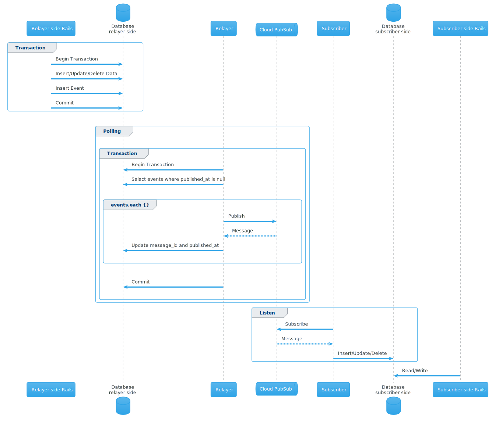

# Trabox

\[[Japanese](README.ja.md)]\[[English](README.md)]

Transactional-Outbox for Rails.


## 機能

- Transactional-Outbox パターンでのイベントデータ公開
- 複数のデータベース・Outbox テーブルに対応
- `publish/subscribe`メソッドをもつ自作の publisher/subscriber を使用可能
- dogstatsd ベースのメトリクス
- 受信するメッセージの順序を維持する

**サポートしている publisher**

- Google Cloud Pub/Sub

## インストール

`Gemfile`に下記を追記

```ruby
gem 'trabox'
```

下記コマンドを実行

```bash
bundle install
bin/rails g trabox:configure
```

これで、`config/initializers/trabox.rb`ファイルが生成されます。

**オプション**

```bash
bundle binstubs trabox
```

## 使い方

### outbox テーブルの作成

下記コマンドで outbox モデルのファイルが作成されます。  
`bin/rails g model`のオプションを使えるので、必要に応じて変更してください。

```bash
# generate model
bin/rails g trabox:model <NAME>

# Help
$ bin/rails g trabox:model --help
Usage:
  rails generate trabox:model NAME [field[:type][:index] field[:type][:index]] [options]
...
```

**追加のオプション: --polymorphic=\<NAME>** オプションをつけると`references`カラムが追加されます。  
このオプションはイミュータブルデータモデルに基づいた設計のときにイベントデータと outbox データを関連づけるのに使用します。

例：`bin/rails g trabox:model example --polymorphic=event`

```ruby
class CreateExamples < ActiveRecord::Migration[6.1]
  def change
    create_table :examples do |t|
      t.references :event, polymorphic: true, null: false # --polymorphicオプションで生成されたカラム
      t.binary :event_data
      t.string :message_id
      t.datetime :published_at

      t.timestamps
    end
  end
end
```

### Relayer 実行

```bash
bin/trabox relay

# Help
bin/trabox relay -h
Usage: trabox relay [OPTIONS]

Overwrite configuration

    -l, --limit NUM
    -i, --interval SEC
    -L, --[no-]lock
        --log-level LEVEL

```

#### Subscriber 実行

```bash
bin/trabox subscribe

# Help
 bin/trabox subscribe -h
Usage: trabox subscribe [OPTIONS]

Overwrite configuration

        --log-level LEVEL
```

## メトリクス

| 名前                            | 説明                                             |
| ------------------------------- | ------------------------------------------------ |
| unpublished_event_count         | パブリッシュするイベント数                       |
| published_event_count           | パブリッシュしたイベント数                       |
| find_events_error_count         | パブリッシュするイベントの取得に失敗した数       |
| publish_event_error_count       | イベントのパブリッシュに失敗した数               |
| update_event_record_error_count | パブリッシュしたイベントのカラム更新に失敗した数 |

## Sequence diagram



## Contributing

Bug reports and pull requests are welcome.

## License

The gem is available as open source under the terms of the [MIT License](https://opensource.org/licenses/MIT).
